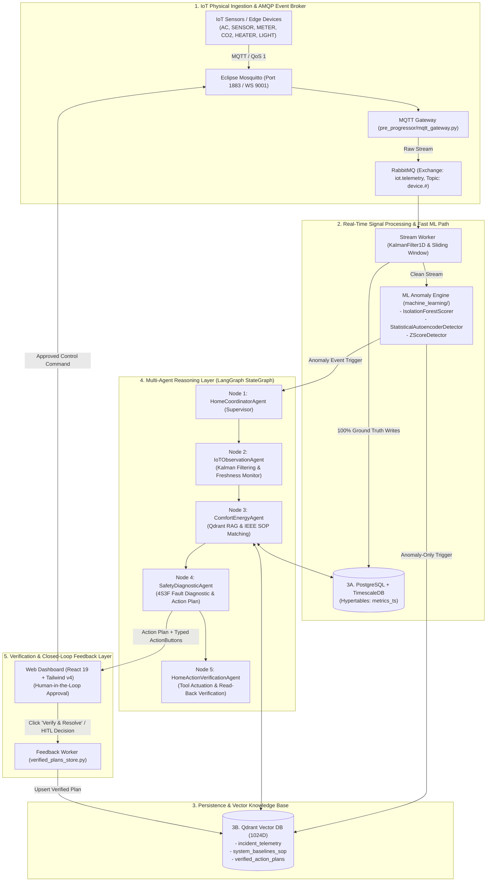

# Aegis-IoT: Multi-Agent IoT Diagnostic, Planning & Closed-Loop Feedback System

Architecture guidelines, service responsibilities, data contracts, and feedback loops.

---

## 1. System Architecture Overview (5-Layer Autonomous Operations)

```
Hackathon_SRC/
├── pre_progressor/     # Layer 1 & 2: Stream Worker (Kalman Smoothing, Windowing) [FastAPI]
├── rabbitmq/           # Layer 1: Ingestion & AMQP Message Broker Topology (iot.telemetry)
├── machine_learning/   # Layer 2: Fast ML Path & Real-time Anomaly Inference [Kalman, iForest, Autoencoder, Z-Score]
├── database/           # Layer 3A: Operational TSDB (PostgreSQL 16 + TimescaleDB Hypertables)
├── rag/                # Layer 3B: Qdrant Vector Engine & Knowledge Base [FastAPI + Qdrant 1024D]
├── agentic/            # Layer 4 & 5: LangGraph 5-Node StateGraph Reasoning & Closed-Loop Feedback
└── backend/            # Presentation & API: FastAPI with 7 Decoupled Modular Routers
```

---

## 2. Layer-by-Layer Responsibilities & Technical Specifications

### Layer 1: IoT Physical Ingestion & AMQP Event Broker
- **IoT Sensors / Edge Devices**: Push real-time telemetry (Power, Temp, Current, PIR Presence, Vibration, Lux, CO2) via MQTT (TCP `1883` / WS `9001`) with QoS Level 1.
- **MQTT Gateway (`pre_progressor/mqtt_gateway.py`)**: Subscribes to `hackathon/smarthome/+/telemetry`, performs schema validation, and forwards to message broker.
- **Message Broker (`rabbitmq/consumer.py`)**:
  - **Exchange**: `iot.telemetry` (type=`topic`, `durable=True`).
  - **Routing Key `device.#`**: Routes raw telemetry to `pre_processor.raw_stream` queue.
  - **Routing Key `anomaly.#`**: Routes flagged anomaly events directly to `ml.anomaly_trigger` queue.
  - **Dead-Letter Exchange (DLX)**: `iot.dlx` with queue `iot.dead_letters` for malformed packets.
  - **TTL & Prefetch**: `MESSAGE_TTL_MS = 30000`, `PREFETCH_COUNT = 1`.

### Layer 2: Signal Processing & Fast ML Path
- **Stream Worker / Pre-processing (`pre_progressor/`)**:
  - Noise filtering via `KalmanFilter1D` ($Q=0.05, R=0.80$), moving window aggregation, and timestamp freshness validation.
  - **Path 1 (100% Write)**: Persists 100% cleaned telemetry ground-truth into **3A. Operational TimescaleDB** (`metrics_ts` hypertable).
  - **Path 2 (Fast Stream)**: Forwards stream to **ML Anomaly Engine**.
- **ML Anomaly Engine (`machine_learning/`)**:
  - **`KalmanFilter1D`**: 1D Linear Kalman Filter for real-time sensor noise smoothing.
  - **`IsolationForestScorer`**: Unsupervised tree path anomaly scoring ($s(x,n) = 2^{-\mathbb{E}(h(x))/c(n)}$) for instant metric spikes.
  - **`StatisticalAutoencoderDetector`**: Temporal reconstruction error modeling ($L(x,\hat{x}) = \frac{1}{d}\sum(x_i-\hat{x}_i)^2$) for subtle mechanical wear and non-linear degradation.
  - **`ZScoreDetector`**: Rolling window statistical outlier scoring.
  - **`calculate_cosine_similarity`**: Dense vector cosine similarity calculation.
  - **Path (Anomaly-only Write)**: On anomaly detection, serializes incident payload to **3B. Qdrant Vector DB** (`incident_telemetry`) and activates the **LangGraph Reasoning Layer**.

### Layer 3: Persistence & Qdrant Vector Database
- **3A. Operational & Time-Series DB (`database/`)**:
  - **Engine**: **PostgreSQL 16 + TimescaleDB** (`timescale/timescaledb-ha:pg16`).
  - **Hypertables (`metrics_ts`)**: Stores 100% telemetry ground truth with 7-day chunking partitions, automatic columnar compression, and analytical `time_bucket()` aggregations.
  - **Relational Tables**: Device registry, maintenance tickets, baseline policies, and audit logs.
- **3B. Vector Database - Qdrant (`database/` & `rag/`)**:
  - **Embedding Standard**: 1024-dimensional semantic embeddings with scalar metadata filtering (`metric_peak_temp`, `anomaly_score`, `device_code`, `timestamp`).
  - **Collection 1: `incident_telemetry`**: Vectorized anomaly patterns + raw feature payloads.
  - **Collection 2: `system_baselines_sop`**: Vectorized normal baseline profiles + Technical Standard Operating Procedures (ASHRAE 36/62.1, IEEE C37, EN 12464-1, IEC 60335-2-21).
  - **Collection 3: `verified_action_plans`**: Vectorized historical verified cases + standard mitigation plans (Used for self-learning / few-shot retrieval).
- **Tool Calling Context**: Exposes tool APIs (Query TimescaleDB SQL, Query Qdrant with hybrid filter, Query Baselines) for the Reasoning Agents.

### Layer 4: Multi-Agent Reasoning Layer (LangGraph 5-Node StateGraph) (`agentic/`)
- **Framework**: **LangGraph (StateGraph)** running inside an asynchronous **FastAPI** service (`agentic/orchestrator.py`).
- **Node 1: HomeCoordinatorAgent (Supervisor)**:
  - Coordinates execution flow across the 5-node cyclic graph with persistent state checkpointing.
  - Manages human-in-the-loop interruptions (`interrupt_before` / `interrupt_after`) for user approval.
- **Node 2: IoTObservationAgent (`agentic/fault_agent.py`)**:
  - Ingests telemetry readings from all 6 Track A devices, applies Kalman smoothing, and validates sensor freshness (identifies stale sensors $> 180s$).
- **Node 3: ComfortEnergyAgent (`agentic/retriever_agent.py`)**:
  - Queries `system_baselines_sop` for equipment thresholds, comfort standards, and energy optimization manuals.
  - Queries `verified_action_plans` for past similar verified incidents.
  - Synthesizes grounded RAG context with confidence scoring.
- **Node 4: SafetyDiagnosticAgent (`agentic/fault_agent.py` & `planning_agent.py`)**:
  - Executes Root Cause Analysis (RCA) using the **TU Delft 4S3F framework (Energy & Buildings 2026)**.
  - Evaluates life-safety risks (high $\text{CO}_2$, dry-burn overheating, electrical overload).
  - Generates step-by-step mitigation plans and synthesizes interactive `ActionButton` controls.
- **Node 5: HomeActionVerificationAgent (`agentic/feedback_agent.py`)**:
  - Dispatches tool actuation commands to MQTT.
  - Executes read-back sensor verification to confirm device state transitions.
  - Dispatches email alerts and WebSocket notifications.

### Layer 5: Verification & Closed-Loop Feedback Loop (Self-Learning Memory)
- **Engineer / Homeowner Dashboard (`frontend/`)**:
  - Displays Real-time Stream + Diagnostic Report + Action Plan + Interactive Action Buttons.
  - User reviews mitigation plan and clicks **Verify / Approve** (`/api/homeowner/hitl-decision`).
- **Feedback Worker (`agentic/feedback_agent.py` & `agentic/verified_plans_store.py`)**:
  - Ingests verified successful resolution plans upon human confirmation.
  - Embeds and upserts the verified case into Qdrant `verified_action_plans` collection.
  - Enables autonomous zero-latency few-shot learning for future incidents.

---

## 3. End-to-End Architecture Diagram



---

## 4. Engineering & AI Harness Rules (Harness Score Level 4 Certified)

1. **Unified Python FastAPI Stack**: All microservices expose asynchronous FastAPI endpoints with OpenAPI docs.
2. **LangGraph State Graph**: Multi-agent loops must be modeled as a 5-Node LangGraph state machine with typed Pydantic V2 schemas (`agentic/schemas.py`) and checkpointing.
3. **Qdrant Vector Standard**: Vector search must utilize the 3 dedicated collections (`incident_telemetry`, `system_baselines_sop`, `verified_action_plans`) with hybrid payload filtering.
4. **TimescaleDB Operational Standard**: Telemetry tables must be defined as TimescaleDB hypertables with chunking and compression policies.
5. **Decoupled Machine Learning Core**: Anomaly scoring and signal filtering algorithms reside in `machine_learning/` with zero cross-dependencies.
6. **Closed-Loop Feedback**: Verified resolutions must be written back to `verified_action_plans` for dynamic self-improvement.
7. **Quality Gate**: Verified via GitHub Actions (`paladini/harness-score@v1`) ensuring 100% Level 4 maturity.
