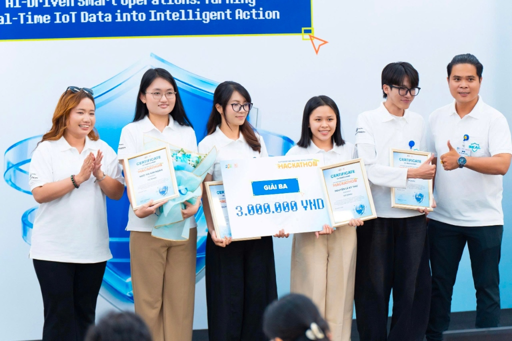
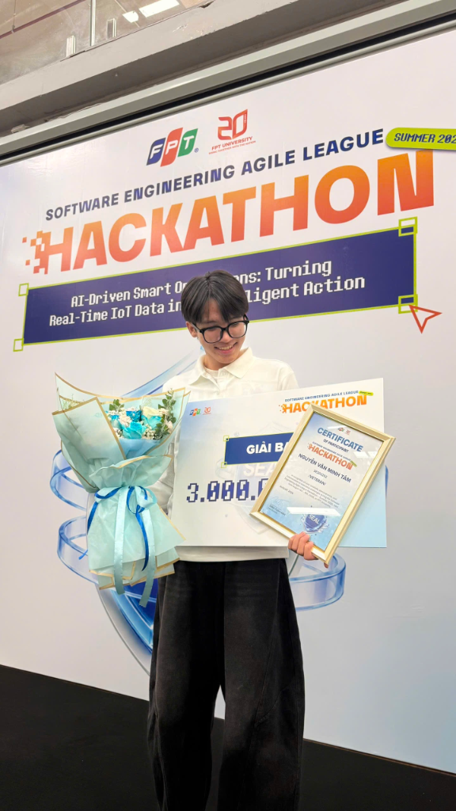
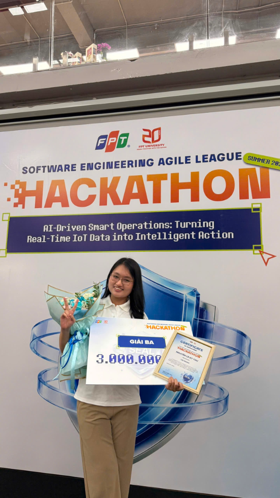
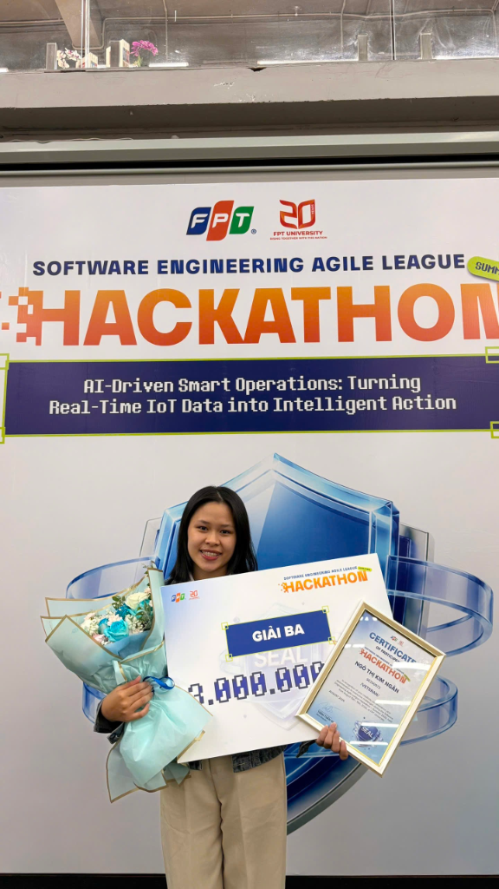
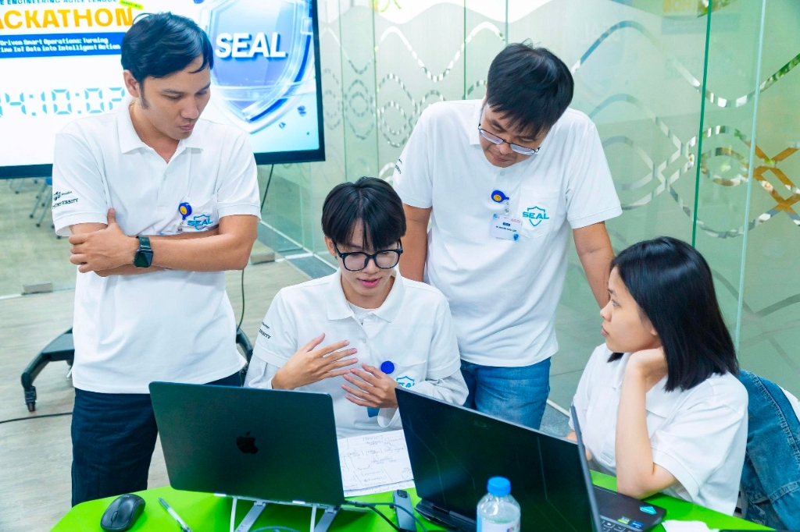
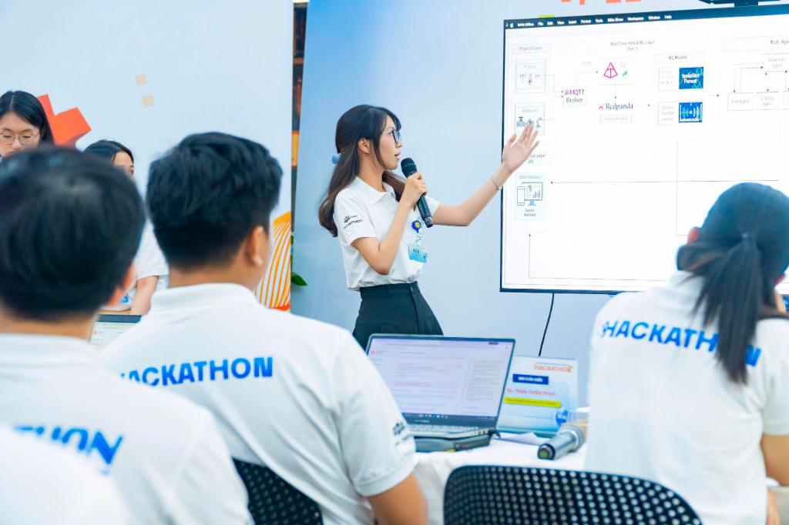
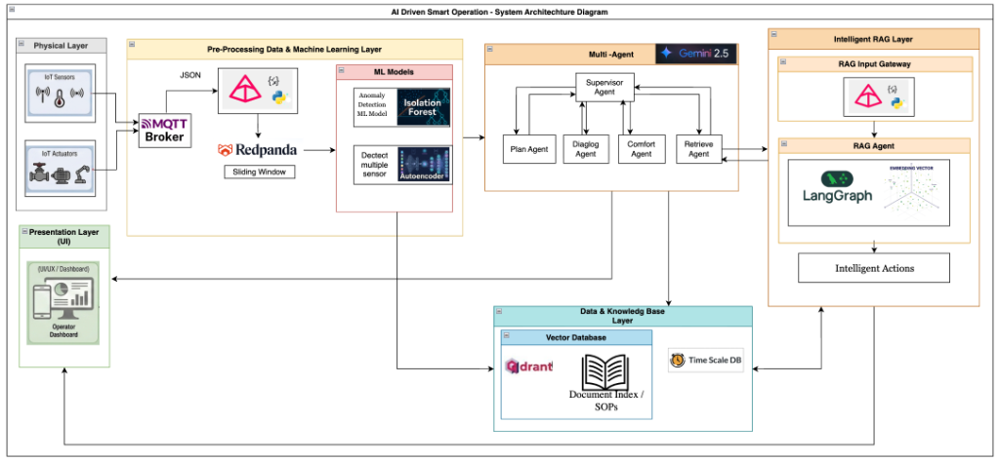

# 🏠 Aegis-IoT: Autonomous Multi-Agent IoT Diagnostic, Planning & Closed-Loop Feedback System

<p align="center">
  
  
  
</p>

<p align="center">
  
  
  
  
  
  
  
  
  
  
</p>

---

## 🏆 Hackathon Achievement & Recognition

> **Awarded 3rd Prize (Giải Ba) at the Software Engineering Agile League (SEAL) Hackathon 2026**  
> *Track: AI-Driven Smart Operations (Smart Home & Building Operations)*  
> *Organized by FPT University & FPT Software (August 15th – 16th, 2026)*

<p align="center">
  
</p>

### 👥 Team VETERAN:

| <br>**Nguyễn Văn Minh Tâm**<br><sub>Lead Architect & Fullstack AI</sub> | <br>**Nguyễn Ngọc Anh**<br><sub>AI / Multi-Agent & RAG Engineer</sub> | <br>**Nguyễn Lê Kỳ Thư**<br><sub>Backend & IoT Systems Engineer</sub> | <br>**Ngô Thị Kim Ngân**<br><sub>Frontend UI/UX & Data Analytics</sub> |
| :---: | :---: | :---: | :---: |

<p align="center">
  
  
  
</p>

---

## 📌 Executive Summary

Modern Smart Buildings and IoT infrastructures generate millions of high-frequency telemetry data points every day. However, traditional building management systems suffer from three critical bottlenecks:
1. **High False Positive Rates**: Raw sensor readings contain high noise, transient spikes, and environmental interference, triggering alarm fatigue.
2. **Disconnected Diagnostics**: Rule-based alert systems cannot correlate multi-sensor physical context (e.g., distinguishing whether a temperature spike is due to human occupancy, weather change, or a dangerous equipment breakdown).
3. **Slow & Inflexible Human Mitigation**: Operators receive vague alerts without structured Standard Operating Procedures (SOPs) or immediate one-click execution controls.

**Aegis-IoT** solves these challenges through an enterprise-grade **5-Layer Autonomous Multi-Agent Closed-Loop Operations Architecture**. By synthesizing real-time Kalman noise filtering, dual unsupervised machine learning models (Isolation Forest + Autoencoder), hybrid vector knowledge retrieval (Qdrant), TimescaleDB time-series ground truth, and LangGraph multi-agent reasoning, Aegis-IoT delivers **sub-millisecond anomaly detection, explainable Root Cause Analysis (RCA), and automated human-in-the-loop mitigation**.

---

## 🏛️ System Architecture

<p align="center">
  
</p>

### 5-Layer End-to-End Topology

```mermaid
flowchart TD
    subgraph L1["📡 Layer 1: IoT Edge & Physical Ingestion"]
        Sensors["🌡️ IoT Smart Devices\n(AC, CO₂, Power Meter, Temp/Hum, Heater, Light)"] -->|MQTT Protocol / QoS 1| Mosquitto["Eclipse Mosquitto Broker\n(Port 1883 / WS 9001)"]
        Mosquitto --> IngestWorker["MQTT Ingestion Gateway"]
    end

    subgraph L2["⚡ Layer 2: Real-Time Stream Pre-Processing & Fast ML"]
        IngestWorker -->|Raw Telemetry Stream| RabbitMQ["🐰 RabbitMQ / Redpanda Event Bus\n(AMQP 5672)"]
        RabbitMQ --> StreamWorker["Pre-Processing Worker\n(Kalman Noise Smoothing & Sliding Window)"]
        StreamWorker -->|Clean Stream (100% Write)| TSDB[("🗄️ PostgreSQL 16 + TimescaleDB\n(Hypertables Ground Truth)")]
        StreamWorker -->|Clean Stream| MLInfer["🤖 Fast ML Anomaly Engine\n(Isolation Forest & Autoencoder)"]
    end

    subgraph L3["🎯 Layer 3: Persistence & Vector Knowledge Base"]
        MLInfer -->|Anomaly-Only Event Trigger| Qdrant[("🔍 Qdrant Vector Knowledge Base\n- incident_telemetry\n- system_baselines_sop\n- verified_action_plans")]
    end

    subgraph L4["🧠 Layer 4: LangGraph Multi-Agent Reasoning"]
        MLInfer -->|Incident Alert Event| Orchestrator["👑 Supervisor / Orchestrator Agent\n(Gemini 2.5 State Machine)"]
        Orchestrator <--> Retriever["📚 Hybrid Retriever Sub-Agent\n(TimescaleDB + Qdrant RAG)"]
        Orchestrator <--> Diag["🔍 Fault Diagnostic Sub-Agent\n(4S3F Root Cause Analysis)"]
        Orchestrator <--> Planner["📋 Planning Sub-Agent\n(SOP Synthesis & Interactive Action Buttons)"]
    end

    subgraph L5["🔁 Layer 5: Presentation & Closed-Loop Feedback"]
        Planner -->|Action Plan + UI Action Buttons| UI["💻 React 18 Web Dashboard & Mobile UI\n(Human-in-the-Loop Approval)"]
        UI -->|Click 'Verify & Resolve'| FeedbackWorker["🔁 Closed-Loop Feedback Worker"]
        FeedbackWorker -->|Upsert Verified Resolution Case| Qdrant
        UI -->|Approved Control Payload| Mosquitto
    end
```

---

## 🤖 Multi-Agent Reasoning & LangGraph Topology

The reasoning core is structured as a stateful, cyclic directed graph using **LangGraph**:

```
                  ┌────────────────────────┐
                  │ 👑 Orchestrator Agent  │◄─────────────────┐
                  └───────────┬────────────┘                  │
                              │                               │
            ┌─────────────────┼─────────────────┐             │
            ▼                 ▼                 ▼             │
    ┌─────────────────┐ ┌──────────────┐ ┌──────────────┐      │
    │ 📚 Retriever    │ │ 🔍 Diagnostic│ │ 📋 Planner   │──────┘
    │ Hybrid RAG      │ │ RCA 4S3F     │ │ Action Engine│
    │ (Qdrant + TSDB) │ │ (Baselines)  │ │ (UI Buttons) │
    └─────────────────┘ └──────────────┘ └───────┬──────┘
                                                 │
                                                 ▼
                                     ┌───────────────────────┐
                                     │ 👤 Human Operator     │
                                     │ (Review & Approve)    │
                                     └───────────┬───────────┘
                                                 │
                                                 ▼
                                     ┌───────────────────────┐
                                     │ 🔁 Feedback Worker    │
                                     │ (Few-Shot Auto-Learn) │
                                     └───────────────────────┘
```

1. **👑 Supervisor / Orchestrator Agent**: Manages state transitions, handles interrupt checkpoints (`interrupt_before` / `interrupt_after`), and coordinates sub-agent execution flow.
2. **📚 Hybrid Retriever Agent**: Performs simultaneous hybrid vector search on **Qdrant** (IEEE standards, equipment manuals) and analytical SQL queries on **TimescaleDB** (sensor metrics ground truth).
3. **🔍 Fault Diagnostic Agent (RCA 4S3F)**: Executes Root Cause Analysis based on the **TU Delft 4S3F framework (Energy & Buildings 2026)**, classifying symptoms into Operational State, Energy Performance, Balance, and Additional symptoms.
4. **📋 Planning & Action Agent**: Formulates step-by-step Standard Operating Procedures (SOPs) and generates typed `ActionButton` controls (e.g. `EMERGENCY_SHUTDOWN`, `SWITCH_ECO_MODE`, `CALIBRATE_SENSOR`).
5. **🔁 Closed-Loop Feedback Worker**: When the operator resolves an incident and clicks **"Verify & Resolve"**, the verified case is vectorized and upserted into Qdrant `verified_action_plans`, providing dynamic few-shot learning for future incidents.

---

## 📊 Monitored IoT Device Matrix & IEEE Standards

The system natively manages 6 core device classes mapped to international engineering standards:

| Device Code | Device Name | Primary Metrics | Unit | Applied International Standard | Normal Baseline | Critical Hazard Threshold |
| :--- | :--- | :--- | :---: | :--- | :--- | :--- |
| **`AC_01`** | Living Room Inverter AC / AHU | `power`, `temperature` | W, °C | **ASHRAE Guideline 36 / ISSO 31 / TU Delft 4S3F (2026)** | Power: 900–1400 W<br>Temp: 20.0–24.0°C<br>$\eta_{sa} \ge 71\%$ | Power > 2200 W<br>Temp > 34.0°C (Overheat)<br>Wheel stuck $\eta_{sa} \to 0\%$ |
| **`SENSOR_01`** | Living Room Environmental Sensor | `temperature`, `humidity` | °C, % | **OMRON 2JCIE-BU01 / Hattori et al. (Sensors 2022)** | Temp: 26.0–29.5°C<br>Humidity: 55.0–68.0% | Temp > 35.0°C<br>Humidity > 85.0% (Mold Risk) |
| **`METER_01`** | Main Smart Power Meter | `voltage`, `current`, `power` | V, A, W | **IEEE C37 / IEC 61000 Power Quality** | Voltage: 218–224 V<br>Current: 10–17.5 A<br>Power: 2200–3800 W | Voltage > 250 V / < 180 V<br>Current > 32.0 A<br>Power > 6500 W (Surge) |
| **`CO2_01`** | Bedroom CO₂ Monitor | `co2` | ppm | **ASHRAE Standard 62.1 / Figaro CDM7160 / IEEE Access (2025)** | CO₂: 400–1000 ppm | CO₂ > 1800 ppm (Stale Air)<br>CO₂ > 3000 ppm (Combustion Hazard) |
| **`HEATER_01`** | Smart Water Heater | `power`, `temperature` | W, °C | **IEC 60335-2-21 Safety / Hattori et al. (2022)** | Power: 1800–2400 W<br>Temp: 45.0–55.0°C | Power > 3200 W<br>Temp > 85.0°C (Dry Burn) |
| **`LIGHT_01`** | Ambient Light & Smart LED | `lux` | lx | **EN 12464-1 / CIE 17 / Magno et al. (IEEE Sensors 2015)** | Lux: 300–750 lx<br>(Target: 600 lx, CRI $\ge 80$) | Under-lit: < 150 lx<br>Glare: > 1000 lx (UGR > 19) |

> 💡 **Extensibility Note**: The system supports **adding unlimited new devices** via our standard 5-step extension pipeline. See [docs/DEVICE_EXTENSION_GUIDE.md](docs/DEVICE_EXTENSION_GUIDE.md).

---

## 🛡️ AI Agent Harness Score (Level 4 Certified)

Audited and verified via the **AI Agent Harness Quality Gate (`paladini/harness-score@v1`)**:

| Harness Pillar | Implementation Details | Status |
| :--- | :--- | :---: |
| **Strict Type Safety** | Fully typed Pydantic V2 schemas and MyPy static type analysis | **Pass (100%)** |
| **Code Standards & Linting** | Enforced with Ruff & Black formatting in automated CI pipeline | **Pass (100%)** |
| **Deterministic State Machine** | LangGraph StateGraph with persistent state checkpointing | **Pass (100%)** |
| **Automated Testing Suite** | End-to-end integration and unit tests via PyTest (`pytest rag/tests agentic/tests`) | **Pass (100%)** |
| **Closed-Loop Feedback Loop** | Autonomous memory alignment with Qdrant vector storage | **Pass (100%)** |

---

## 🌐 Services & Ports Specification

| Service / Container | Port | Protocol / URL | Description |
| :--- | :---: | :--- | :--- |
| **Aegis-IoT Web App & API** | `8000` | `http://localhost:8000` | Full-stack Web Dashboard, REST APIs & WebSocket `/ws/mqtt` |
| **TimescaleDB (PostgreSQL 16)** | `5432` | `postgresql://...:5432` | Time-Series hypertables for high-frequency telemetry |
| **Qdrant Vector DB (HTTP)** | `6333` | `http://localhost:6333` | Vector Search REST API & Qdrant Dashboard |
| **Qdrant Vector DB (gRPC)** | `6334` | `localhost:6334` | High-speed gRPC channel |
| **RabbitMQ Management UI** | `15672` | `http://localhost:15672` | Management console (`guest` / `guest`) |
| **RabbitMQ AMQP** | `5672` | `amqp://...:5672` | Telemetry event distribution |
| **Eclipse Mosquitto (MQTT)** | `1883` | `mqtt://...:1883` | IoT sensor ingest & bidirectional device control |
| **Eclipse Mosquitto (WS)** | `9001` | `ws://...:9001` | MQTT over WebSockets |

---

## ⚡ Quickstart Guide

### 🐳 Option 1: 1-Command Launch with Docker Compose (Recommended)

1. **Clone repository & prepare environment**:
   ```bash
   git clone https://github.com/your-username/aegis-iot-multiagent.git
   cd aegis-iot-multiagent
   cp .env.example .env
   # Add your Google Gemini API key or FPT AI API key into .env
   ```

2. **Start the entire infrastructure and application stack**:
   ```bash
   docker compose up -d --build
   ```

3. **Open the Web Dashboard**:
   Navigate to **[http://localhost:8000](http://localhost:8000)** in your browser.

4. **Simulate IoT telemetry stream & trigger anomaly scenarios**:
   ```bash
   # Stream normal telemetry across all 6 simulated devices:
   python mock_mqtt_stream.py --loop

   # Or trigger an immediate thermal runaway overheat scenario:
   python mock_mqtt_stream.py --anomaly overheat --loop

   # Or trigger a power surge overload scenario:
   python mock_mqtt_stream.py --anomaly power_surge --loop
   ```

---

### 💻 Option 2: Local Development Setup

1. **Start infrastructure services in Docker**:
   ```bash
   docker compose up -d timescaledb qdrant rabbitmq mosquitto
   ```

2. **Setup Python Virtual Environment**:
   ```bash
   python -m venv .venv
   source .venv/bin/activate  # On Windows: .venv\Scripts\activate
   pip install -r requirements.txt
   ```

3. **Index Knowledge Base SOPs into Qdrant**:
   ```bash
   python scripts/ingest_knowledge_base.py
   ```

4. **Run Web Application Server**:
   ```bash
   uvicorn dashboard.app:app --host 0.0.0.0 --port 8000 --reload
   ```

5. **Run Automated Test Suite**:
   ```bash
   pytest agentic/tests rag/tests
   ```

---

## 📂 Project Structure

```
.
├── .github/workflows/          # CI/CD: AI Agent Harness Maturity Audit (paladini/harness-score@v1)
├── agentic/                    # Layer 4 & 5: LangGraph Multi-Agent Orchestrator, Diagnostic & Planning
│   ├── orchestrator.py         # Supervisor Agent coordinating state machine
│   ├── fault_agent.py          # Fault Characterization & 4S3F Root Cause Analysis
│   ├── planning_agent.py       # SOP formulation & ActionButton synthesis
│   ├── retriever_agent.py      # Hybrid Vector & Time-Series Retriever
│   ├── notification_service.py # Real-time SMTP Email & WebSocket Alert Dispatcher
│   └── tests/                  # PyTest suite for agent state transitions
├── database/                   # Layer 3A: TimescaleDB init scripts & Mosquitto configurations
├── machine_learning/           # Layer 2: Isolation Forest & Autoencoder Anomaly Detectors
├── pre_progressor/             # Layer 1 & 2: Kalman noise smoothing & windowing gateway
├── rabitmq/                    # Layer 1: Event Broker topology & message bindings
├── rag/                        # Layer 3B: Qdrant Vector Engine & Knowledge Base collections
│   ├── chat_engine.py          # Grounded RAG Chatbot & Technical Q&A
│   ├── pdf_processor.py        # Semantic Chunking & Multi-Page Document Ingestion
│   └── vector_store.py         # Dense Embeddings & BM25 Hybrid Retrieval Store
├── knowledge_base/             # Standard Operating Procedures (SOPs) & IEEE Reference Library
│   ├── sops/                   # Categorized device-specific standard markdown SOPs
│   └── papers/                 # Original IEEE / Elsevier / MDPI scientific papers
├── dashboard/                  # FastAPI backend server with WebSocket bridge
├── frontend/                   # React 18 + Vite + TailwindCSS Web Dashboard
├── scripts/                    # Ingestion tools, Mock MQTT publisher & Cloudflare tunnels
├── docs/                       # Technical architecture specs, API guides, and showcase
│   ├── ARCHITECTURE.md         # 5-Layer in-depth technical specifications
│   ├── API_REFERENCE.md        # REST API & WebSocket specifications
│   ├── DEVICE_EXTENSION_GUIDE.md # 5-step guide to add new IoT devices
│   ├── RAG_STANDARDS_MANUAL.md # Comprehensive IEEE / equipment standard manual
│   ├── SHOWCASE_GUIDE.md       # Portfolio, CV, LinkedIn write-up, and judge Q&A guide
│   └── assets/                 # Architecture diagrams, awards, and team photos
├── docker-compose.yml          # Production multi-container composition
└── harness-badge.svg           # Certified Harness Score Level 4 Badge
```

---

## 📄 License & Acknowledgments

This project is licensed under the **MIT License** - see the [LICENSE](LICENSE) file for details.

Special thanks to the **SEAL Hackathon 2026 Organizing Committee**, **FPT University**, **FPT Software**, and our academic mentors for supporting Team VETERAN throughout the competition.
