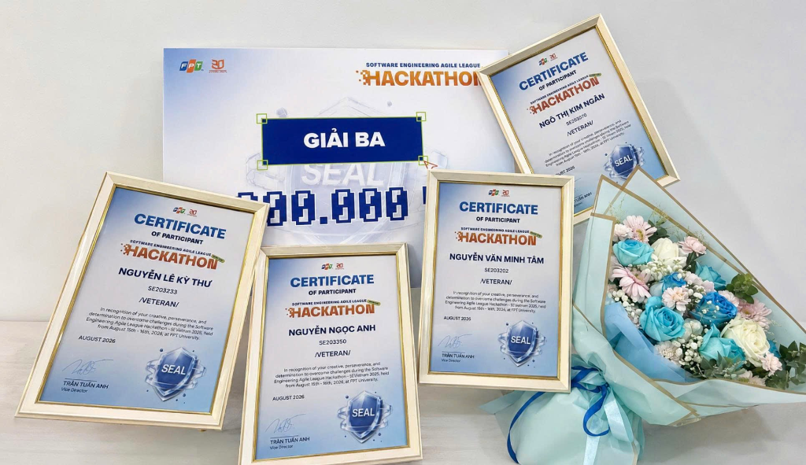
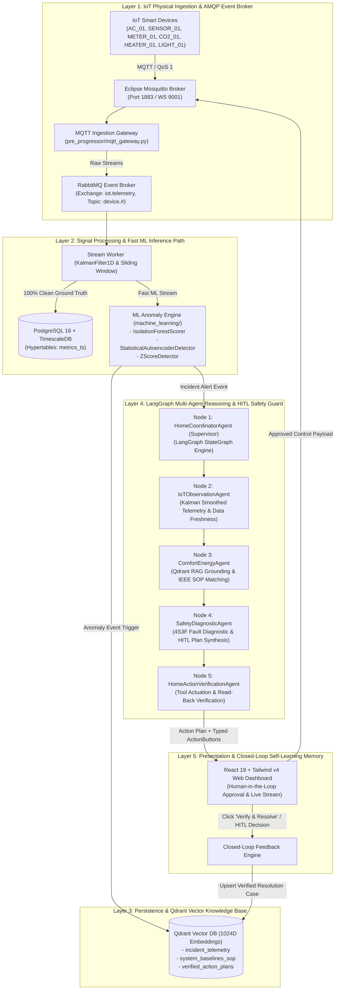

# Aegis-IoT: Autonomous Multi-Agent IoT Diagnostic, Planning & Closed-Loop Feedback System

<p align="center">
  
  
  
</p>

<p align="center">
  
  
  
  
  
  
  
  
  
  
  
</p>

---

## 1. Hackathon Achievement & Recognition

> **3rd Prize Winner (Giải Ba) — Software Engineering Agile League (SEAL) Hackathon 2026**  
> *Track: AI-Driven Smart Operations (Smart Home & Building Operations)*  
> *Organized by FPT University & FPT Software (August 15–16, 2026)*

<p align="center">
  
</p>

### Team VETERAN

| <br>**Nguyễn Văn Minh Tâm**<br>**Team Leader**<br><sub>Lead Architect & Fullstack AI<br>Multi-Agent & RAG Engineer</sub> | <br>**Nguyễn Ngọc Anh**<br>**Member**<br><sub>Frontend UI/UX & AI Engineer<br>(Machine Learning)</sub> | <br>**Nguyễn Lê Kỳ Thư**<br>**Member**<br><sub>Frontend UI/UX<br>& Data Analytics</sub> | <br>**Ngô Thị Kim Ngân**<br>**Member**<br><sub>Backend & IoT Systems Engineer<br>(Agent & Business Logic Design)</sub> |
| :---: | :---: | :---: | :---: |

<table align="center" style="border: none; border-collapse: collapse; margin: 0 auto; width: 100%;">
  <tr style="border: none;">
    <td width="50%" style="border: none; padding: 4px; vertical-align: middle;">
      
    </td>
    <td width="50%" style="border: none; padding: 4px; vertical-align: middle;">
      
      
    </td>
  </tr>
</table>

<p align="center">
  
  
</p>

---

## 2. Executive Summary

Modern Smart Buildings and IoT infrastructures generate millions of high-frequency telemetry data points daily. Traditional building management systems face three core operational challenges:

1. **High False Positive Rates**: Raw sensor readings contain high noise, transient spikes, and environmental interference, triggering alarm fatigue.
2. **Disconnected Diagnostics**: Rule-based alert systems cannot correlate multi-sensor physical context (e.g., distinguishing whether a temperature spike is due to human occupancy, weather change, or equipment breakdown).
3. **Slow & Inflexible Human Mitigation**: Operators receive vague alerts without structured Standard Operating Procedures (SOPs) or immediate one-click execution controls.

**Aegis-IoT** addresses these challenges through a **5-Layer Autonomous Multi-Agent Closed-Loop Operations Architecture**. By synthesizing real-time Kalman noise filtering, dual unsupervised machine learning models (Isolation Forest + Autoencoder), hybrid vector knowledge retrieval (Qdrant), TimescaleDB time-series ground truth, and LangGraph multi-agent reasoning, Aegis-IoT delivers **sub-millisecond anomaly detection, explainable Root Cause Analysis (RCA), and automated human-in-the-loop mitigation**.

---

## 3. 5-Layer Autonomous Operations Architecture

<p align="center">
  
</p>



---

## 4. Scientific Foundations & Mathematical Framework

Aegis-IoT implements standardized mathematical models for signal smoothing, unsupervised outlier detection, and reconstruction error modeling:

### 1D Linear Kalman Filter (Sensor Noise Reduction)
Used in `machine_learning/kalman_filter.py` for continuous telemetry smoothing ($x_k \in \mathbb{R}$):

$$\begin{aligned}
\text{Predict Step:} \quad & \hat{x}_{k|k-1} = \hat{x}_{k-1|k-1}, \quad P_{k|k-1} = P_{k-1|k-1} + Q \\
\text{Kalman Gain:} \quad & K_k = \frac{P_{k|k-1}}{P_{k|k-1} + R} \\
\text{Update Step:} \quad & \hat{x}_{k|k} = \hat{x}_{k|k-1} + K_k \cdot (z_k - \hat{x}_{k|k-1}) \\
\text{Covariance Update:} \quad & P_{k|k} = (1 - K_k) \cdot P_{k|k-1}
\end{aligned}$$

*Parameters: $Q = 0.05$ (Process noise covariance), $R = 0.80$ (Measurement noise covariance), and $z_k$ is the raw sensor reading.*

### Isolation Forest Anomaly Scoring (Liu et al., IEEE ICDM 2008)
Used in `machine_learning/anomaly_scorer.py` for fast multi-dimensional outlier scoring:

$$s(x, n) = 2^{ -\frac{\mathbb{E}(h(x))}{c(n)} }$$

Where $c(n)$ is the average path length of an unsuccessful search in a Binary Search Tree (BST) built on $n$ samples ($n = 256$):

$$c(n) = 2 \cdot \left(\ln(n - 1) + \gamma\right) - \frac{2(n - 1)}{n}$$

*Euler–Mascheroni constant $\gamma \approx 0.5772156649$. Score $s \to 1.0$ indicates anomaly, while $s < 0.50$ indicates normal behavior.*

### Statistical Autoencoder (Reconstruction Loss Anomaly Detection)
Used in `machine_learning/autoencoder_detector.py` for subtle equipment wear & non-linear degradation:

$$L(x, \hat{x}) = \frac{1}{d} \sum_{i=1}^{d} \left( x_i - \hat{x}_i \right)^2, \quad \text{Anomaly Flag} = \mathbb{I}\left( \frac{L - \mu_L}{\sigma_L} > \theta_{\text{threshold}} \right)$$

### Dense Vector Cosine Similarity (Qdrant RAG Grounding)
Used in `machine_learning/cosine_similarity.py` and `rag/vector_store.py` for semantic retrieval against 1024-dimensional embeddings:

$$\text{Cosine}(u, v) = \frac{u \cdot v}{\|u\|_2 \cdot \|v\|_2} = \frac{\sum_{i=1}^{1024} u_i v_i}{\sqrt{\sum_{i=1}^{1024} u_i^2} \cdot \sqrt{\sum_{i=1}^{1024} v_i^2}}$$

---

## 5. LangGraph Multi-Agent Reasoning Topology

The multi-agent core is structured as a 5-node cyclic `StateGraph` coordinator in `agentic/orchestrator.py`:

```
                  ┌───────────────────────────────────────────────────────────┐
                  │ Node 1: HomeCoordinatorAgent (Supervisor)                 │◄─────────────────┐
                  └─────────────────────────────┬─────────────────────────────┘                  │
                                                │                                                │
                                                ▼                                                │
                  ┌───────────────────────────────────────────────────────────┐                  │
                  │ Node 2: IoTObservationAgent (Signal Filter & Freshness)   │                  │
                  └─────────────────────────────┬─────────────────────────────┘                  │
                                                │                                                │
                                                ▼                                                │
                  ┌───────────────────────────────────────────────────────────┐                  │
                  │ Node 3: ComfortEnergyAgent (Qdrant RAG & SOP Retrieval)   │                  │
                  └─────────────────────────────┬─────────────────────────────┘                  │
                                                │                                                │
                                                ▼                                                │
                  ┌───────────────────────────────────────────────────────────┐                  │
                  │ Node 4: SafetyDiagnosticAgent (4S3F RCA & Plan Synthesis) │                  │
                  └─────────────────────────────┬─────────────────────────────┘                  │
                                                │                                                │
                                                ▼                                                │
                  ┌───────────────────────────────────────────────────────────┐                  │
                  │ Node 5: HomeActionVerificationAgent (Actuation & Read-Back│                  │
                  └─────────────────────────────┬─────────────────────────────┘                  │
                                                │                                                │
                                                ▼                                                │
                                    ┌───────────────────────┐                                    │
                                    │ Human Operator        │                                    │
                                    │ (Review & HITL Action)│                                    │
                                    └───────────┬───────────┘                                    │
                                                │                                                │
                                                ▼                                                │
                                    ┌───────────────────────┐                                    │
                                    │ Closed-Loop Memory    │────────────────────────────────────┘
                                    │ (Few-Shot Auto-Learn) │
                                    └───────────────────────┘
```

1. **Node 1: HomeCoordinatorAgent (Supervisor)**: Orchestrates the LangGraph state machine, manages intent routing, and aggregates execution trace steps.
2. **Node 2: IoTObservationAgent**: Cleans sensor streams via Kalman Filter 1D, checks data freshness, and verifies telemetry health.
3. **Node 3: ComfortEnergyAgent (RAG)**: Retrieves grounded clauses from IEEE/ASHRAE standards and past verified cases from Qdrant vector collections.
4. **Node 4: SafetyDiagnosticAgent (4S3F RCA)**: Performs Root Cause Analysis based on the TU Delft 4S3F framework (Energy & Buildings 2026), assesses safety risks, and synthesizes structured `MitigationPlan` with interactive `ActionButton` payloads.
5. **Node 5: HomeActionVerificationAgent**: Dispatches actuation payloads to MQTT, executes read-back sensor verification, and handles notifications.
6. **Closed-Loop Feedback Engine**: On operator approval, vectorizes the verified incident context into Qdrant `verified_action_plans` for dynamic zero-latency few-shot learning.

---

## 6. Monitored IoT Device Matrix & Applied Standards

The platform natively ingests and manages 6 device classes mapped to international engineering standards:

| Device Code | Device Name | Primary Metrics | Unit | Applied International Standard | Normal Baseline | Critical Hazard Threshold |
| :--- | :--- | :--- | :---: | :--- | :--- | :--- |
| **`AC_01`** | Living Room Inverter AC / AHU | `power`, `temperature` | W, °C | **ASHRAE Guideline 36 / ISSO 31 / TU Delft 4S3F (2026)** | Power: 900–1400 W<br>Temp: 20.0–24.0°C<br>$\eta_{sa} \ge 71\%$ | Power > 2200 W<br>Temp > 34.0°C (Overheat)<br>Wheel stuck $\eta_{sa} \to 0\%$ |
| **`SENSOR_01`** | Living Room Environmental Sensor | `temperature`, `humidity` | °C, % | **OMRON 2JCIE-BU01 / Hattori et al. (Sensors 2022)** | Temp: 26.0–29.5°C<br>Humidity: 55.0–68.0% | Temp > 35.0°C<br>Humidity > 85.0% (Mold Risk) |
| **`METER_01`** | Main Smart Power Meter | `voltage`, `current`, `power` | V, A, W | **IEEE C37 / IEC 61000 Power Quality** | Voltage: 218–224 V<br>Current: 10–17.5 A<br>Power: 2200–3800 W | Voltage > 250 V / < 180 V<br>Current > 32.0 A<br>Power > 6500 W (Surge) |
| **`CO2_01`** | Bedroom CO₂ Monitor | `co2` | ppm | **ASHRAE Standard 62.1 / Figaro CDM7160 / IEEE Access (2025)** | CO₂: 400–1000 ppm | CO₂ > 1800 ppm (Stale Air)<br>CO₂ > 3000 ppm (Combustion Hazard) |
| **`HEATER_01`** | Smart Water Heater | `power`, `temperature` | W, °C | **IEC 60335-2-21 Safety / Hattori et al. (2022)** | Power: 1800–2400 W<br>Temp: 45.0–55.0°C | Power > 3200 W<br>Temp > 85.0°C (Dry Burn) |
| **`LIGHT_01`** | Ambient Light & Smart LED | `lux` | lx | **EN 12464-1 / CIE 17 / Magno et al. (IEEE Sensors 2015)** | Lux: 300–750 lx<br>(Target: 600 lx, CRI $\ge 80$) | Under-lit: < 150 lx<br>Glare: > 1000 lx (UGR > 19) |

---

## 7. 7 Modular FastAPI Routers Ecosystem

The backend (`backend/`) is organized into 7 decoupled routers:

| Router File | Prefix / Tag | Key Endpoints | Responsibilities |
| :--- | :--- | :--- | :--- |
| **`agent_router.py`** | `Multi-Agent` | `/api/simulate-anomaly`<br>`/api/execute-action`<br>`/api/active-incident`<br>`/api/homeowner/hitl-decision`<br>`/api/schedules`<br>`/api/maintenance-tickets` | 5-Node StateGraph execution, HITL approval flow, active incident caching, ticket management |
| **`mqtt_router.py`** | `MQTT` | `/ws/mqtt` (WebSocket)<br>`/api/mqtt/status`<br>`/api/mqtt/devices`<br>`/api/mqtt/device/{code}`<br>`/api/mqtt/publish` | Real-time WebSocket streaming, device registry, live control dispatch |
| **`rag_router.py`** | `RAG` | `/api/rag/upload-pdf`<br>`/api/rag/documents`<br>`/api/rag/chat`<br>`/api/rag/history`<br>`/api/rag/stats`<br>`/api/rag-query` | PDF parsing, chunk indexing, dense retrieval, grounded conversational RAG |
| **`model_router.py`** | `ML Models` | `/api/calculate-model` | In-memory evaluation of Kalman Filter, Isolation Forest, Z-Score, Cosine, and Autoencoder |
| **`notification_router.py`** | `Notifications` | `/api/notifications/settings`<br>`/api/notifications/recipients/add`<br>`/api/notifications/history`<br>`/api/notifications/test`<br>`/api/subscribe-email` | SMTP alert settings, subscriber list management, real-time alert dispatch |
| **`verified_plans_router.py`** | `Verified Plans` | `/api/history/verified-plans`<br>`/api/history/verified-plans/{id}`<br>`/api/history/verified-plans/seed` | Layer 5 closed-loop memory CRUD and seed management |
| **`chat_router.py`** | `Chat Sessions` | `/api/chat/sessions`<br>`/api/chat/sessions/sync`<br>`/api/chat/sessions/{id}` | Multi-device chat session synchronization and persistence |

---

## 8. AI Agent Harness Score (Level 4 Certified)

Audited and verified via the **AI Agent Harness Quality Gate (`paladini/harness-score@v1`)**:

| Harness Pillar | Implementation Details | Status |
| :--- | :--- | :---: |
| **Strict Type Safety** | Fully typed Pydantic V2 schemas (`agentic/schemas.py`) and MyPy static type analysis | **Pass (100%)** |
| **Code Standards & Linting** | Enforced with Ruff & Black formatting in automated CI pipeline | **Pass (100%)** |
| **Deterministic State Machine** | LangGraph StateGraph with persistent state checkpointing | **Pass (100%)** |
| **Automated Testing Suite** | End-to-end integration and unit tests via PyTest (`pytest rag/tests agentic/tests`) | **Pass (100%)** |
| **Closed-Loop Feedback Loop** | Autonomous memory alignment with Qdrant vector storage | **Pass (100%)** |

---

## 9. Services & Ports Specification

| Service / Container | Port | Protocol / URL | Description |
| :--- | :---: | :--- | :--- |
| **Aegis-IoT Web App & API** | `8000` | `http://localhost:8000` | Full-stack Web Dashboard, REST APIs & WebSocket `/ws/mqtt` |
| **TimescaleDB (PostgreSQL 16)** | `5432` | `postgresql://...:5432` | Time-Series hypertables for high-frequency telemetry |
| **Qdrant Vector DB (HTTP)** | `6333` | `http://localhost:6333` | Vector Search REST API & Qdrant Dashboard |
| **Qdrant Vector DB (gRPC)** | `6334` | `localhost:6334` | High-speed gRPC channel |
| **RabbitMQ Management UI** | `15672` | `http://localhost:15672` | Management console (`guest` / `guest`) |
| **RabbitMQ AMQP** | `5672` | `amqp://...:5672` | Telemetry event distribution |
| **Eclipse Mosquitto (MQTT)** | `1883` | `mqtt://...:1883` | IoT sensor ingest & bidirectional device control |
| **Eclipse Mosquitto (WS)** | `9001` | `ws://...:9001` | MQTT over WebSockets |

---

## 10. Quickstart Guide

### Option 1: 1-Command Zero-Config Launch with Docker (Recommended)

1. **Clone repository & Start entire stack with 1 command**:
   ```bash
   git clone https://github.com/veteran-smart-ops-hackathon/iot-smart-home-ai-ops.git
   cd iot-smart-home-ai-ops
   docker compose up -d --build
   ```
   *(Optional: If you want to use custom Gemini AI Studio API keys or SMTP alerts, copy `.env.example` to `.env` and fill your keys before or after running).*

2. **Access Web Portals**:
   - **Unified Web Operations Dashboard**: **[http://localhost:8000](http://localhost:8000)** (React 19 SPA + Multi-Agent Center)
   - **RabbitMQ AMQP Management UI**: **[http://localhost:15672](http://localhost:15672)** (User: `guest`, Pass: `guest`)
   - **Qdrant Vector Engine UI / API**: **[http://localhost:6333/dashboard](http://localhost:6333/dashboard)**
   - **TimescaleDB Telemetry TSDB**: Port `5432` (`iot_ground_truth` hypertable)

3. **Simulate IoT Telemetry Stream & Anomaly Scenarios**:
   ```bash
   # Run E2E telemetry stream simulation:
   python scripts/publish_mock_mqtt.py

   # Or run E2E scenario tests directly:
   python scripts/test_e2e_live.py
   ```

---

### Option 2: Local Development Setup

1. **Start infrastructure services in Docker**:
   ```bash
   docker compose up -d timescaledb qdrant rabbitmq mosquitto
   ```

2. **Setup Python Virtual Environment**:
   ```bash
   python -m venv .venv
   source .venv/bin/activate  # On Windows: .venv\Scripts\activate
   pip install -r requirements.txt
   ```

3. **Index Knowledge Base SOPs into Qdrant**:
   ```bash
   python scripts/ingest_knowledge_base.py
   ```

4. **Run Web Application Server**:
   ```bash
   uvicorn backend.app:app --host 0.0.0.0 --port 8000 --reload
   ```

5. **Run Automated Test Suite**:
   ```bash
   pytest agentic/tests rag/tests
   ```

---

## 11. Project Structure

```
.
├── .github/workflows/          # CI/CD: AI Agent Harness Maturity Audit (paladini/harness-score@v1)
├── agentic/                    # Layer 4 & 5: LangGraph Multi-Agent Orchestrator, Diagnostic & Planning
│   ├── orchestrator.py         # 5-Node LangGraph StateGraph Supervisor Agent
│   ├── fault_agent.py          # IoTObservationAgent & SafetyDiagnosticAgent (4S3F RCA)
│   ├── planning_agent.py       # PlanningAndActionAgent (SOP formulation & ActionButton synthesis)
│   ├── retriever_agent.py      # ComfortEnergyAgent (Hybrid Qdrant RAG & TSDB Retriever)
│   ├── feedback_agent.py       # HomeActionVerificationAgent (Tool Execution & Read-Back Verification)
│   ├── verified_plans_store.py # Layer 5 Closed-Loop Memory Persistence Store
│   ├── notification_service.py # Real-time SMTP Email & WebSocket Alert Dispatcher
│   ├── schemas.py              # Strict Pydantic V2 Schemas for State & Payload Contracts
│   └── tests/                  # PyTest suite for agent state transitions
├── database/                   # Layer 3A: TimescaleDB init scripts & Mosquitto configurations
│   ├── init.sql                # Hypertables, compression policies, and analytical views
│   └── mosquitto.conf          # MQTT broker listener & authentication settings
├── machine_learning/           # Layer 2: Signal Processing & Anomaly Detection Algorithms
│   ├── kalman_filter.py        # 1D Linear Kalman Filter (noise reduction)
│   ├── anomaly_scorer.py       # Isolation Forest (unsupervised tree path anomaly scoring)
│   ├── autoencoder_detector.py # Statistical Autoencoder (reconstruction-loss degradation detector)
│   ├── zscore_detector.py      # Rolling Z-Score outlier detector
│   └── cosine_similarity.py    # Dense vector cosine similarity calculation
├── pre_progressor/             # Layer 1 & 2: MQTT Gateway & stream pre-processing
│   └── mqtt_gateway.py         # Real-time multi-sensor smoothing, windowing & dispatch
├── rabbitmq/                   # Layer 1: AMQP Message Queue & routing topologies
│   └── consumer.py             # Event broker topology (iot.telemetry, DLX, prefetch controls)
├── rag/                        # Layer 3B: Qdrant Vector Engine & Knowledge Base collections
│   ├── chat_engine.py          # Grounded RAG Chatbot & Technical Q&A
│   ├── pdf_processor.py        # Semantic Chunking & Multi-Page Document Ingestion
│   ├── vector_store.py         # Dense Embeddings & BM25 Hybrid Retrieval Store
│   └── tests/                  # PyTest suite for vector ingestion & search accuracy
├── knowledge_base/             # Standard Operating Procedures (SOPs) & IEEE Reference Library
│   ├── sops/                   # Categorized device-specific standard markdown SOPs
│   └── papers/                 # Original IEEE / Elsevier / MDPI scientific papers
├── backend/                   # FastAPI Web Backend with 7 Modular Routers
│   ├── app.py                  # Main FastAPI Application entrypoint & static mounts
│   ├── dependencies.py         # Dependency injection providers for agents & stores
│   └── routers/                # Decoupled REST & WebSocket Routers
│       ├── agent_router.py     # Multi-Agent StateGraph & HITL endpoints
│       ├── mqtt_router.py      # MQTT WebSockets & device control
│       ├── rag_router.py       # Document indexing & RAG chat
│       ├── model_router.py     # Signal ML calculations & benchmarks
│       ├── notification_router.py # Alert subscriptions & SMTP config
│       ├── verified_plans_router.py # Layer 5 feedback memory CRUD
│       └── chat_router.py      # Multi-session chat persistence
├── frontend/                   # React 19 + Vite + TailwindCSS v4 Web Dashboard
│   ├── src/views/              # Views: AgenticView, DeviceView, RAGStudioView, MLModelView, etc.
│   └── package.json            # React 19, Lucide, KaTeX, Recharts dependencies
├── scripts/                    # Ingestion tools, Mock MQTT publisher & Cloudflare tunnels
├── docs/                       # Comprehensive Architecture & Developer Documentation
│   ├── ARCHITECTURE.md         # 5-Layer in-depth technical specifications
│   ├── API_REFERENCE.md        # 7-Router REST API & WebSocket specifications
│   ├── SHOWCASE_GUIDE.md       # 5 Demo scenarios & technical defense cheat sheet
│   ├── DEVICE_EXTENSION_GUIDE.md # 5-step guide to add new IoT devices
│   ├── RAG_STANDARDS_MANUAL.md # Comprehensive IEEE / equipment standard manual
│   └── assets/                 # Architecture diagrams, awards, and team photos
├── docker-compose.yml          # Production multi-container composition
└── harness-badge.svg           # Certified Harness Score Level 4 Badge
```

---

## 12. License & Acknowledgments

This project is licensed under the **MIT License** - see the [LICENSE](LICENSE) file for details.

Special thanks to the **SEAL Hackathon 2026 Organizing Committee**, **FPT University**, **FPT Software**, and our academic mentors for supporting Team VETERAN throughout the competition.
