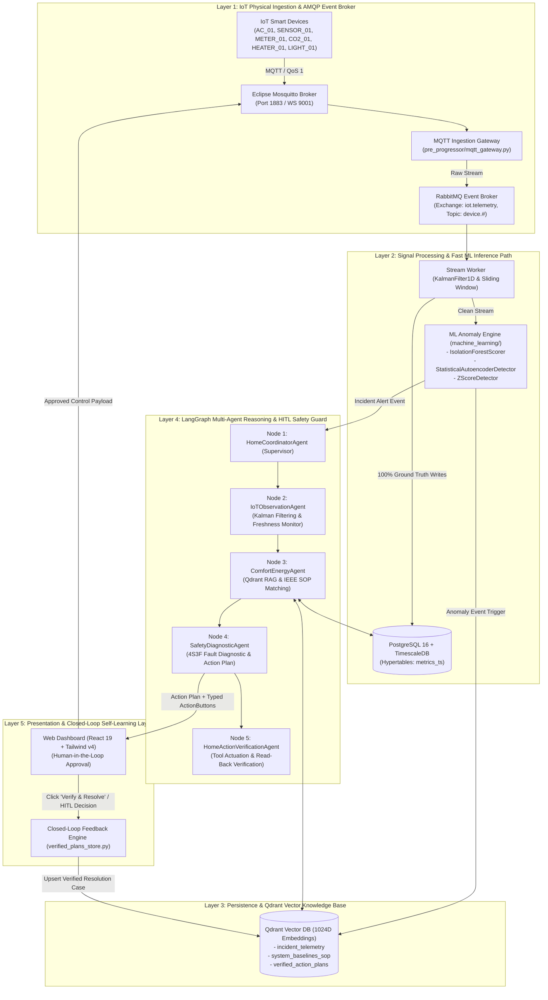
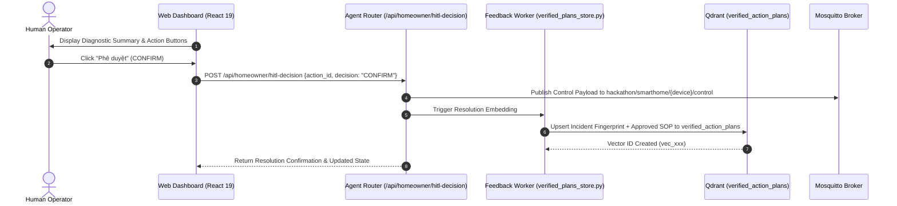

# Aegis-IoT: 5-Layer System Architecture & Technical Specifications

> **SEAL Hackathon 2026 - 3rd Prize Winner**  
> **Track: AI-Driven Smart Operations (Smart Home & Industrial Building Operations)**  
> **Team VETERAN | Certified AI Agent Harness Score Level 4**

---

## 1. System Architecture Overview

<p align="center">
  
</p>

Aegis-IoT is engineered as a decoupled, multi-tiered autonomous diagnostic and control platform structured into 5 foundational layers:



---

## 2. Layer-by-Layer Technical Deep Dive

### Layer 1: IoT Physical Ingestion & AMQP Event Broker

#### 1. Eclipse Mosquitto MQTT Broker
- Handles standard TCP port `1883` and WebSocket port `9001`.
- Enforces **QoS Level 1** (At least once delivery) with offline message buffering.
- Standardized topic taxonomy:
  - Telemetry: `hackathon/smarthome/{device_code}/telemetry`
  - Control: `hackathon/smarthome/{device_code}/control`

#### 2. AMQP Exchange Topology (`rabbitmq/consumer.py`)
```
  IoT Sensors / Edge Devices (MQTT Gateway)
        │
        ▼
  Exchange: "iot.telemetry" (type=topic, durable=True)
        │
        ├── Routing Key: "device.#"   ──→ Queue: "pre_processor.raw_stream"
        │                                         ↓
        │                               pre_progressor/ (Kalman Smoothing)
        │                                         ↓
        │                               100% Write → TimescaleDB (Ground Truth)
        │
        └── Routing Key: "anomaly.#"  ──→ Queue: "ml.anomaly_trigger"
                                                  ↓
                                        machine_learning/ (Isolation Forest / Autoencoder)
                                                  ↓
                                        Anomaly Write → Qdrant + LangGraph Trigger
```
- **Dead-Letter Exchange (DLX)**: `iot.dlx` routing to `iot.dead_letters`.
- **Message Policy**: `MESSAGE_TTL_MS = 30000` (drops stale frames), `PREFETCH_COUNT = 1` (fair dispatch).

---

### Layer 2: Signal Processing & Fast ML Inference Path

The signal processing engine decouples raw physical fluctuations from high-level reasoning through two synchronized pipelines:

#### 1. 1D Linear Kalman Filter (`machine_learning/kalman_filter.py`)
Filters high-frequency electrical and thermal noise before storage:

$$\hat{x}_{k|k-1} = \hat{x}_{k-1|k-1}, \quad P_{k|k-1} = P_{k-1|k-1} + Q$$

$$K_k = \frac{P_{k|k-1}}{P_{k|k-1} + R}, \quad \hat{x}_{k|k} = \hat{x}_{k|k-1} + K_k (z_k - \hat{x}_{k|k-1}), \quad P_{k|k} = (1 - K_k) P_{k|k-1}$$

*Default parameters: $Q = 0.05$, $R = 0.80$, $P_0 = 1.0$.*

#### 2. Dual Machine Learning Inference (`machine_learning/`)
- **Isolation Forest (`anomaly_scorer.py`)**: Computes normalized tree path anomaly score $s(x,n) = 2^{-\mathbb{E}(h(x))/c(n)}$. Evaluates instant multi-dimensional metric anomalies (power spikes, sudden voltage drops).
- **Statistical Autoencoder (`autoencoder_detector.py`)**: Computes temporal reconstruction loss $L(x, \hat{x}) = \frac{1}{d} \sum_{i=1}^d (x_i - \hat{x}_i)^2$ to flag progressive mechanical degradation and bearing wear before physical breakdown.
- **Rolling Z-Score (`zscore_detector.py`)**: Detects standard deviation threshold breaches on sliding windows.

---

### Layer 3: TimescaleDB & Qdrant Vector Knowledge Base

#### 1. Operational Time-Series Database (TimescaleDB / PostgreSQL 16)
- **Hypertable `metrics_ts`**: Automatically partitioned into 7-day time chunks with columnar compression:
  ```sql
  SELECT create_hypertable('metrics_ts', 'timestamp', chunk_time_interval => INTERVAL '7 days');
  ALTER TABLE metrics_ts SET (timescaledb.compress, timescaledb.compress_segmentby = 'device_code');
  SELECT add_compression_policy('metrics_ts', INTERVAL '14 days');
  ```
- Sub-millisecond continuous aggregations using `time_bucket('1 minute', timestamp)`.

#### 2. Qdrant Vector Knowledge Engine (1024D Embeddings)
- **Collection 1: `incident_telemetry`**: Stores real-time vectorized anomaly fingerprints with scalar filters (`device_code`, `metric_peak_temp`, `anomaly_score`, `timestamp`).
- **Collection 2: `system_baselines_sop`**: Stores IEEE, ASHRAE, and manufacturer Standard Operating Procedures chunked semantically.
- **Collection 3: `verified_action_plans`**: Stores verified past mitigation cases for dynamic few-shot learning.

---

### Layer 4: LangGraph Multi-Agent Reasoning Topology (`agentic/`)

Implemented as a 5-node cyclic `StateGraph` in `agentic/orchestrator.py`:

```
[Anomaly Event Trigger] ──> [Node 1: HomeCoordinatorAgent (Supervisor)]
                                          │
                                          ▼
                            [Node 2: IoTObservationAgent]
                            - Kalman noise smoothing
                            - Sensor freshness validation (>180s stale check)
                                          │
                                          ▼
                            [Node 3: ComfortEnergyAgent]
                            - Query Qdrant system_baselines_sop
                            - Query Qdrant verified_action_plans
                            - Analytical TimescaleDB queries
                                          │
                                          ▼
                            [Node 4: SafetyDiagnosticAgent]
                            - 4S3F Fault Isolation (TU Delft framework)
                            - Life safety & hazard verification
                            - Synthesize MitigationPlan & ActionButtons
                                          │
                                          ▼
                            [Node 5: HomeActionVerificationAgent]
                            - MQTT command actuation
                            - Read-back sensor verification
                            - Email alert & WebSocket dispatch
                                          │
                                          ▼
                               [Human-in-the-Loop Gate]
```

#### Typed Graph State Contract (`agentic/schemas.py`)
```python
class MultiAgentState(TypedDict):
    readings: List[DeviceMLReading]
    diagnostic_report: Optional[DiagnosticReport]
    rag_grounding_context: Optional[RAGGroundingContext]
    mitigation_plan: Optional[MitigationPlan]
    verified_history: Optional[List[Dict[str, Any]]]
    traces: List[AgentTraceStep]
    status: str
```

---

### Layer 5: Presentation & Closed-Loop Self-Learning Memory



- **Autonomous Memory Upsert**: Clicking **"Verify & Resolve"** or confirming via HITL converts the resolved case into a 1024D dense vector in Qdrant `verified_action_plans`.
- **Dynamic Few-Shot Learning**: When a similar fault occurs, Node 3 retrieves this verified plan (Cosine similarity $> 0.85$), instantly providing proven mitigation steps and avoiding repetitive trial-and-error reasoning.

---

## 3. AI Agent Harness Score (Level 4 Maturity Standard)

Audited and verified via the **AI Agent Harness Quality Gate (`paladini/harness-score@v1`)**:

| Pillar | Implementation | Verification Tool | Status |
| :--- | :--- | :--- | :---: |
| **Strict Type Safety** | 100% Pydantic V2 schemas (`agentic/schemas.py`) with MyPy static validation | `mypy agentic/ rag/ machine_learning/` | **Pass (100%)** |
| **Code Linting & Formatting** | Automated Black & Ruff linting in CI workflow | `.github/workflows/harness_score.yml` | **Pass (100%)** |
| **Deterministic State Machine** | LangGraph StateGraph with persistent checkpoints | `agentic/orchestrator.py` | **Pass (100%)** |
| **Automated Testing Suite** | End-to-end unit & integration test coverage | `pytest agentic/tests rag/tests` | **Pass (100%)** |
| **Continuous Closed-Loop Learning**| Qdrant-backed verified memory refinement | `agentic/verified_plans_store.py` | **Pass (100%)** |
