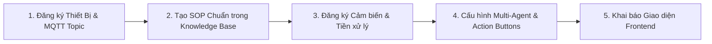

# 🔌 Hướng Dẫn Chi Tiết Quy Trình Mở Rộng & Thêm Thiết Bị Mới Vào Hệ Thống Aegis-IoT

> **Dành cho Kỹ sư Phát triển & Đội ngũ Mở rộng Hệ thống**  
> Hệ thống Aegis-IoT được thiết kế theo kiến trúc hướng module 5 tầng mở (Decoupled Scalable Architecture), cho phép **thêm mới không giới hạn các loại thiết bị IoT và cảm biến thông minh** mà không làm thay đổi cấu trúc nền tảng.

---

## 1. Khả Năng Mở Rộng Của Kiến Trúc 5 Tầng

| Tầng Hệ Thống | Cơ Chế Hỗ Trợ Mở Rộng Thiết Bị Mới (Scalability Mechanism) |
| :--- | :--- |
| **Tầng 1: IoT Ingestion** | Giao thức MQTT phân tán hỗ trợ wildcard topic `hackathon/smarthome/+/telemetry`. Tự động nhận diện `device_code` mới. |
| **Tầng 2: Pre-processing & Fast ML** | Bộ lọc Kalman tự động khởi tạo luồng xử lý riêng cho từng chuỗi metric; Mô hình ML kiểm tra bất thường đa chiều linh hoạt. |
| **Tầng 3: TimescaleDB & Qdrant** | TimescaleDB Hypertables lưu trữ bản ghi theo `device_code` và cột `payload JSONB`; Qdrant Vector DB tự động cập nhật tri thức khi nạp file SOP mới. |
| **Tầng 4: LangGraph Multi-Agent** | Các Pydantic Schema (`IncidentContext`, `ActionButton`) nhận diện động mọi mã thiết bị; Retriever tự động tìm SOP tương ứng qua Semantic Vector Search. |
| **Tầng 5: React Dashboard & Feedback** | `metricsRegistry.ts` quản lý metadata giao diện tập trung; Feedback Worker tự động học các ca xử lý thành công cho thiết bị mới. |

---

## 2. Quy Trình 5 Bước Thêm Thiết Bị Mới Từ A Đến Z



---

### 🟢 Bước 1: Khai Báo Định Danh Thiết Bị & MQTT Topic

1. **Quy tắc đặt mã thiết bị (`device_code`):**
   - Viết hoa, kèm số định danh: Ví dụ: `PUMP_01` (Máy bơm nước), `SMOKE_01` (Cảm biến khói/cháy), `SOLAR_01` (Biến tần năng lượng mặt trời), `FAN_01` (Quạt thông gió).
2. **Quy chuẩn Topic MQTT:**
   - **Topic đẩy dữ liệu (Telemetry):** `hackathon/smarthome/{device_code}/telemetry`
   - **Topic nhận lệnh điều khiển (Control):** `hackathon/smarthome/{device_code}/control`
3. **Cấu trúc gói tin JSON Telemetry chuẩn:**
   ```json
   {
     "device_code": "PUMP_01",
     "device_name": "Máy Bơm Tăng Áp Tầng Mái",
     "status": "NORMAL",
     "timestamp": "2026-08-21T15:30:00.000Z",
     "pressure": 3.2,
     "flow_rate": 45.0,
     "power": 750.0,
     "temperature": 42.5
   }
   ```

---

### 🟢 Bước 2: Tạo Tài Liệu Chuẩn Kỹ Thuật (SOP) Trong Knowledge Base

1. Tạo một thư mục con tương ứng trong `knowledge_base/sops/`:
   ```bash
   mkdir -p knowledge_base/sops/08_water_pump_pump01
   ```
2. Tạo file tài liệu quy chuẩn kỹ thuật theo mẫu `SOP_IEEE_PUMP_01_Water_Pump_Safety.md`, mô tả:
   - **Dải vận hành định mức (Normal):** Áp suất $2.5 - 3.8\text{ bar}$, công suất $< 900\text{ W}$, nhiệt độ cuộn dây $< 60^\circ\text{C}$.
   - **Ngưỡng nguy hiểm (Critical Hazard):** Áp suất $> 5.0\text{ bar}$ (nguy cơ vỡ đường ống) hoặc chạy khô không có nước (Dry Run).
   - **Quy trình xử lý sự cố:** Các bước cô lập và ngắt nguồn khẩn cấp.
3. Chạy script nạp tài liệu vào Qdrant:
   ```bash
   python scripts/ingest_knowledge_base.py
   ```

---

### 🟢 Bước 3: Đăng Ký Cảm Biến & Tiền Xử Lý Dữ Liệu

1. Mở file [pre_progressor/mqtt_gateway.py](file:///Users/nguyenvanminhtam/Documents/Hackathon_SRC/pre_progressor/mqtt_gateway.py):
   - Đăng ký các metric mới cần làm mịn Kalman (ví dụ: `pressure`, `flow_rate`):
   ```python
   # Hệ thống sẽ tự động khởi tạo bộ lọc Kalman theo từng metric name
   CLEAN_METRICS = ["temperature", "humidity", "power", "current", "voltage", "co2", "lux", "pressure", "flow_rate"]
   ```
2. Cập nhật script giả lập dữ liệu [scripts/publish_mock_mqtt.py](file:///Users/nguyenvanminhtam/Documents/Hackathon_SRC/scripts/publish_mock_mqtt.py) để thêm nhánh sinh dữ liệu cho thiết bị mới khi chạy chế độ mock.

---

### 🟢 Bước 4: Cấu Hình Multi-Agent Reasoning & Nút Bấm Hành Động

1. Mở file [agentic/schemas.py](file:///Users/nguyenvanminhtam/Documents/Hackathon_SRC/agentic/schemas.py):
   - Nếu thiết bị có các trường đặc thù, bổ sung vào `IncidentContext`.
2. Mở file [agentic/planning_agent.py](file:///Users/nguyenvanminhtam/Documents/Hackathon_SRC/agentic/planning_agent.py):
   - Thêm các nút bấm hành động tương tác (`ActionButton`) tiêu chuẩn dành riêng cho thiết bị mới:
   ```python
   # Ví dụ các action buttons cho PUMP_01:
   DEVICE_ACTION_TEMPLATES["PUMP_01"] = [
       ActionButton(
           action_id="SHUTDOWN_PUMP",
           label="Ngắt Nguồn Máy Bơm",
           variant="danger",
           topic="hackathon/smarthome/PUMP_01/control",
           payload={"action": "POWER_OFF", "reason": "OVERPRESSURE_PROTECTION"}
       ),
       ActionButton(
           action_id="SWITCH_AUTO_RELIEF",
           label="Xả Áp Tự Động",
           variant="warning",
           topic="hackathon/smarthome/PUMP_01/control",
           payload={"action": "OPEN_PRESSURE_RELIEF_VALVE"}
       )
   ]
   ```

---

### 🟢 Bước 5: Khai Báo Metadata Trên Giao Diện Frontend Dashboard

Mở file [frontend/src/constants/metricsRegistry.ts](file:///Users/nguyenvanminhtam/Documents/Hackathon_SRC/frontend/src/constants/metricsRegistry.ts):
Đăng ký thông tin hiển thị của thiết bị mới vào bảng registry:

```typescript
export const DEVICE_METRIC_REGISTRY = {
  // ... các thiết bị cũ ...
  PUMP_01: {
    deviceName: "Máy Bơm Tăng Áp Tầng Mái",
    deviceCode: "PUMP_01",
    category: "HVAC & Thủy Lực",
    icon: "Activity",
    primaryMetric: "pressure",
    unit: "bar",
    safeRange: [2.5, 3.8],
    warningRange: [3.9, 4.8],
    criticalRange: [4.9, 7.0],
    actionAdvice: "Khi áp suất vượt quá 4.8 bar, tự động ngắt động cơ bơm để bảo vệ đường ống thủy lực."
  }
};
```

---

## 3. Ví Dụ Thực Hành Mẫu: Thêm Cảm Biến Khói Cháy Báo Động (`SMOKE_01`)

### Gói tin MQTT thử nghiệm:
```bash
# Gửi gói tin thử nghiệm bình thường:
mosquitto_pub -h localhost -p 1883 -t "hackathon/smarthome/SMOKE_01/telemetry" \
  -m '{"device_code":"SMOKE_01","device_name":"Cảm biến Khói Phòng Bếp","status":"NORMAL","timestamp":"2026-08-21T15:30:00Z","smoke_density":12.5,"temperature":28.0}'

# Gửi gói tin kích hoạt sự cố khẩn cấp (Cháy/Khói nồng độ cao):
mosquitto_pub -h localhost -p 1883 -t "hackathon/smarthome/SMOKE_01/telemetry" \
  -m '{"device_code":"SMOKE_01","device_name":"Cảm biến Khói Phòng Bếp","status":"ANOMALY","timestamp":"2026-08-21T15:30:00Z","smoke_density":185.0,"temperature":82.0}'
```

Ngay khi gói tin bất thường được đẩy lên:
1. Fast ML Engine phát hiện `smoke_density > 100` và `temperature > 75°C`.
2. Multi-Agent kích hoạt chuỗi tác tử: Retriever quét SOP `SMOKE_01`, Diagnostic chẩn đoán rủi ro phát hỏa, Planner sinh phương án: Cắt điện toàn nhà (`METER_01`), Tắt điều hòa (`AC_01`) chống lan khói, và gửi Email khẩn cấp kèm nút bấm **"KÍCH HOẠT HỆ THỐNG CHỮA CHÁY / BÁO CỨU HỎA"**.
