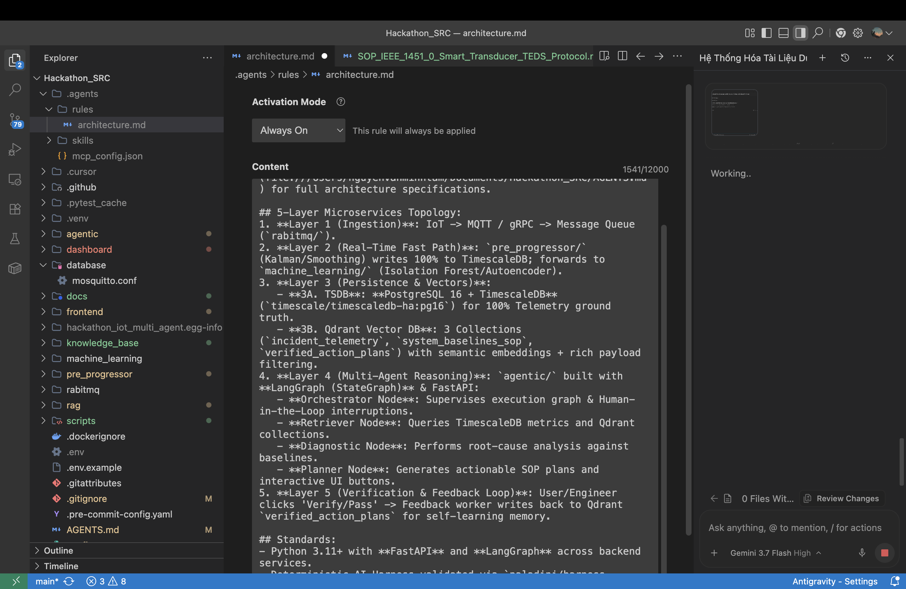

# 📘 IEEE 1451.0 SMART TRANSDUCER INTERFACE & TEDS PROTOCOL SPECIFICATION (SYSTEM_FDD)

> **Applied Subsystem:** `SYSTEM_FDD` & IoT Physical Transducer Gateway (`pre_progressor/`, `agentic/`)  
> **Reference Standards:** IEEE Std 1451.0-2007 (Smart Transducer Interface for Sensors and Actuators) / IEEE 1451.5 (Wireless Transducers)  
> **Classification:** Standard Operating Procedure (SOP) & Edge-to-Agent Transducer Architecture

---

## 1. IEEE 1451 Family Architecture & Key Entities

The Aegis-IoT edge and multi-agent layers adhere to the **IEEE Std 1451.0-2007** reference model for plug-and-play smart sensor interoperability:

```
┌────────────────────────────────────────────────────────┐
│      NCAP (Network Capable Application Processor)       │
│  - Gateway between IoT message bus and Multi-Agent     │
│  - Executes Transducer Services API (HTTP / MQTT)      │
└──────────────────────────┬─────────────────────────────┘
                           │
                 [IEEE 1451.X Protocol]
                           │
┌──────────────────────────▼─────────────────────────────┐
│          TIM (Transducer Interface Module)              │
│  - Contains physical sensor/actuator channels          │
│  - Stores onboard Transducer Electronic Data Sheets     │
│  - Performs local signal conditioning, ADC/DAC & Calib │
└────────────────────────────────────────────────────────┘
```

---

## 2. Transducer Electronic Data Sheets (TEDS) Formats

Every sensor in Aegis-IoT is described by machine-readable TEDS structures:

| TEDS Type | Access Code | Mandatory / Optional | Key Encoded Fields |
| :--- | :---: | :---: | :--- |
| **Meta-TEDS** | `0x01` | **Mandatory** | UUID (10 octets), Worst-case operational time-out, Max channels count, Channel grouping |
| **TransducerChannel TEDS** | `0x03` | **Mandatory** | Physical units (SI base exponents), LowLimit, HiLimit, Uncertainty, Data model (Float32/UInt16), Sampling mode |
| **Calibration TEDS** | `0x05` | Optional | Calibration date, Calibration interval, SI slope $m$, Intercept $b$ ($y = mx + b$), or Polynomial matrix |
| **User's Transducer Name TEDS** | `0x0C` | **Mandatory** | Human-readable tag (e.g. `"LIVING_ROOM_AC_01"`, `"MAIN_POWER_METER"`) |
| **PHY TEDS** | `0x0D` | **Mandatory** | Physical media specs (Zigbee 802.15.4 / WiFi / RS-485 Modbus) |

---

## 3. Physical Units SI Exponent Representation (Clause 4.11)

Units are encoded as an array of 10 octets representing exponents of 7 SI base units + radians + steradians:
$$\text{Unit} = \text{rad}^{e_1} \cdot \text{sr}^{e_2} \cdot \text{m}^{e_3} \cdot \text{kg}^{e_4} \cdot \text{s}^{e_5} \cdot \text{A}^{e_6} \cdot \text{K}^{e_7} \cdot \text{mol}^{e_8} \cdot \text{cd}^{e_9}$$

* Exponent values are encoded as: $\text{EncodedValue} = 2 \times \text{Exponent} + 128$
* **Temperature (°C / K)**: `0C 06 32 01 00 39 01 82` (Kelvin exponent = 1, with conversion offset $273.15$).
* **Power (Watt = $\text{m}^2 \cdot \text{kg} \cdot \text{s}^{-3}$)**: Meter $= 2$, Kilogram $= 1$, Second $= -3$.

---

## 4. Transducer Services API Integration in Aegis-IoT

Aegis-IoT maps IEEE 1451.0 Transducer Services to REST & WebSocket gateways:
* **TIM Discovery**: `GET /1451/Discovery/TIMDiscovery` $\to$ Discovers all active sensors on the mesh.
* **Transducer Access**: `GET /1451/TransducerAccess/ReadData?timId=1&channelId=2` $\to$ Returns calibrated telemetry.
* **TEDS Manager**: `GET /1451/TEDSManager/ReadTeds` $\to$ Ingests TEDS directly into Qdrant `system_baselines_sop` for automated zero-configuration Agent understanding.
